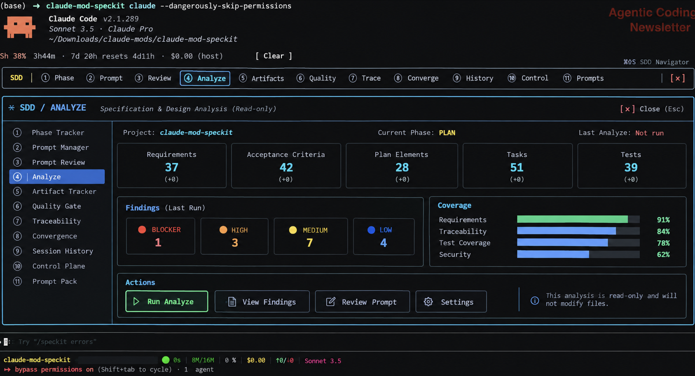

# Spec-Kit SDD Mods


## What is a Claude Mod?

A **Claude Mod** is a plugin that changes Claude Code from the inside. It is a small set of function hooks that can draw a live pane, a band, a status line or a toast, add slash commands, and intercept prompts or tool calls. Mods load with `--plugin-dir` and hot-reload in the running session, so there is no fork of Claude Code and no wrapper process.

This repository is a set of twelve Mods that add a **Spec-Driven Development (SDD)** layer on top of [GitHub Spec-Kit](https://github.com/github/spec-kit): see which phase you are in, review and approve the prompt before a phase runs, track artifacts and requirement traceability, and gate progress on evidence.



*The `/sdd` Navigator with the Analyze view open: findings by severity, coverage, and read-only Analyze actions.*

## The Mods

| # | Folder | Plugin | Role | Command |
|---|---|---|---|---|
| 00 | `00-sdd-navigator` | `sdd-navigator` | UI shell: nav row, view slot, Back/Close, the single status line. No business logic. | `/sdd` |
| 01 | `01-phase-tracker` | `sdd-phase-tracker` | Current phase, progress and transitions, derived from the artifact inventory. | `/sdd-status` |
| 02 | `02-prompt-manager` | `sdd-prompt-manager` | Templates, layer composition, prompt resolution, template edit/save/reset, Pack catalog. | `/sdd-prompt` |
| 03 | `03-prompt-review-gate` | `sdd-prompt-review` | **Sole interceptor** and human approval gate before a phase runs. Fails closed. | `/sdd-run <phase>`, `/sdd-review` |
| 04 | `04-analyze-gate` | `sdd-analyze-gate` | Semantic Analyze findings, best-effort read-only run guard, Analyze result state. | `/sdd-analyze` |
| 05 | `05-artifact-tracker` | `sdd-artifact-tracker` | Canonical artifact inventory, hashes and the single staleness model. | `/sdd-artifacts` |
| 06 | `06-quality-gate` | `sdd-quality-gate` | Evidence-backed phase gates. **Sole owner** of Approve, Reject and Continue. | `/sdd-quality` |
| 07 | `07-traceability` | `sdd-traceability` | Deterministic requirement-ID graph, trace matrix, gaps and orphans. | `/sdd-trace` |
| 08 | `08-convergence-tracker` | `sdd-convergence-tracker` | Evidence-based convergence, regressions and recorded exceptions. | `/sdd-converge` |
| 09 | `09-session-history` | `sdd-session-history` | Bounded, project-keyed history of SDD actions. Observer only. | `/sdd-history` |
| 10 | `10-sdd-control-plane` | `sdd-control-plane` | Derived aggregate view, `nextAction`, config view. Reads and delegates only. | none (Navigator view) |
| 11 | `11-default-sdd-prompt-pack` | `sdd-default-prompt-pack` | **Content only**: nine editable prompt templates plus `pack.json`. | none |

Each Mod works alone through its text command. `/sdd` opens the Navigator, which embeds the capability views. If a view fails to appear, it falls back to one pane at a time.

## Quick start

Requires Claude Code and a Spec-Kit project (for example `specify init --integration claude`).

```bash
# from your Spec-Kit project: loads all 12 Mods for this session only (nothing is installed)
/path/to/claude-mod-speckit/mods/scripts/sdd-claude.sh
```

**Session-only, not installed.** The launcher uses `--plugin-dir`, so the Mods exist only for that Claude Code session and your global setup is untouched. This is deliberate: `03` intercepts `/speckit-*` commands, so a global install would enable the Review Gate in every project. A permanent install (for example into `~/.claude/local-mods/`) is planned once the interactive checks listed under Status pass.

Then run `/sdd`. Hotkeys in the pane: `1`–`9`, `0` and `p` open views, `b` goes Back, `Esc` closes the pane.

## Repository layout

| Path | What |
|---|---|
| `00-…md` … `11-…md` | Architectural specs, one per Mod (source of truth). |
| `AMEND-SPECKIT-MODS*.md` | Amendment briefs. |
| `mods/` | Implementation. See [`mods/README.md`](mods/README.md). |
| `mods/_shared/` | Pure helpers, copied into each plugin by `npm run sync`. |
| `screenshots/` | README images. |
| `SESSION-HANDOFF.md` | State, open items and next steps. |

## Develop

```bash
cd mods
npm install
npm run sync && npm run sync:check
npm run typecheck     # load each plugin once first so the engine writes .claude-plugin/types
npm run validate
npm test
```

## Design rules

- One owner per state noun. `03` is the sole interceptor, `06` the sole Approve/Reject/Continue, `05` the sole artifact and staleness owner, `07` the sole ID graph, `02` the sole template editor, `10` aggregates and delegates only, `11` is content only.
- Unknown, missing or unanswerable approval fails closed. There is no invented quality score.
- Every stored record is keyed by project. Project data lives in `.speckit/mod/`.

## Status

Verified: `tsc` 11/11, `claude plugin validate` 12/12, 148 harness tests, and a real-engine run against a Spec-Kit 1.1.0 fixture. Not yet verified in an interactive session: plugin load order, Button `onPress` delegation, person-origin Esc and interactive `/speckit-*` routing. Open spec-wording decisions are listed in [`SESSION-HANDOFF.md`](SESSION-HANDOFF.md).
